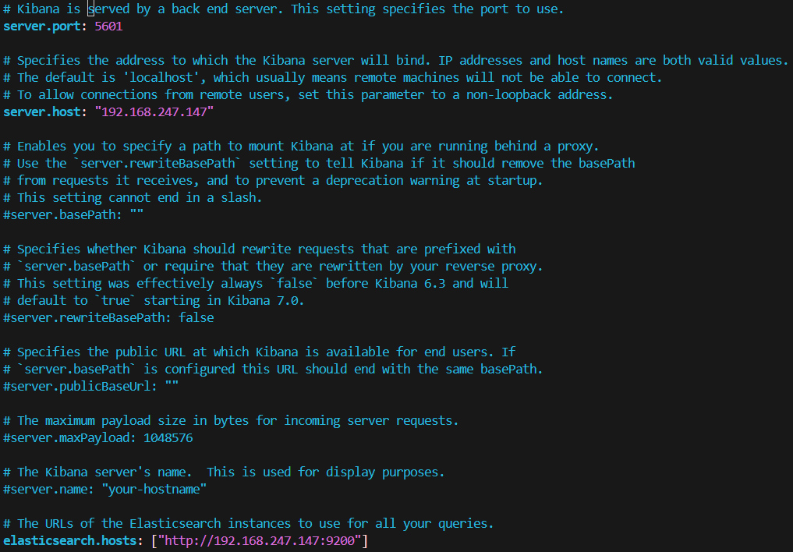
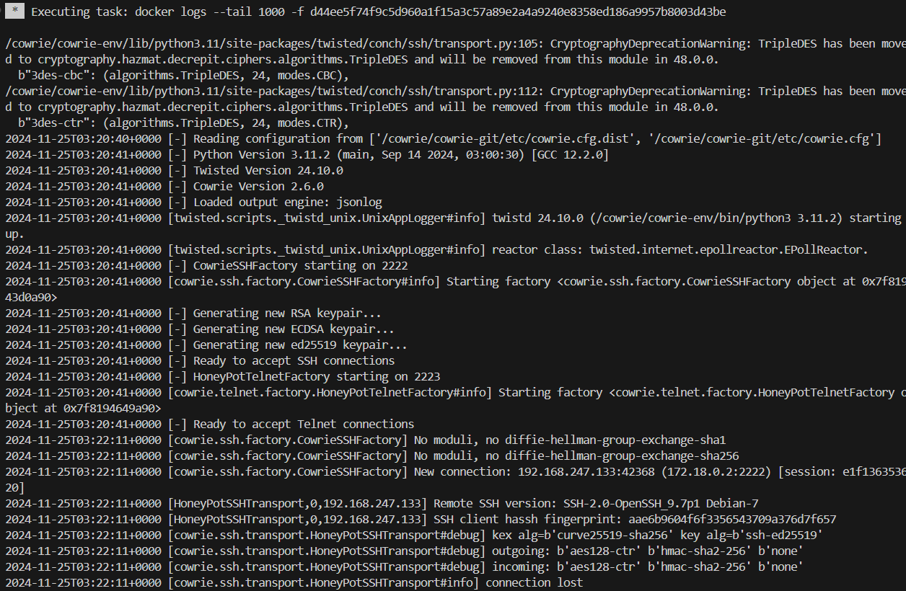
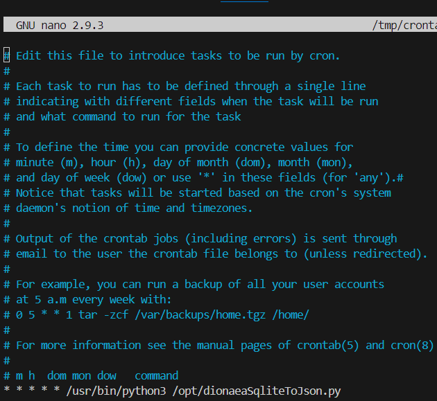
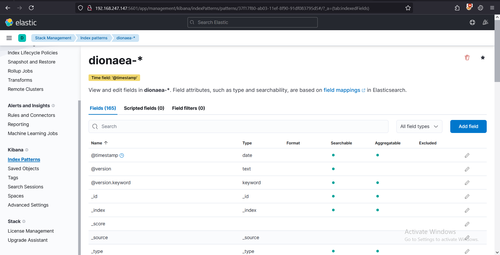

# Instructions to integrate honeypot logs into the ELK Stack

## ELK Prerequisites

    sudo apt -y install default-jre default-jdk

    curl -fsSL https://artifacts.elastic.co/GPG-KEY-elasticsearch | apt-key add -

    echo "deb https://artifacts.elastic.co/packages/7.x/apt stable main" > /etc/apt/sources.list.d/elastic-7.x.list

    sudo apt update

## Installing ELK Stack for Honeypot Logs

- **ElasticSearch Installation**

        sudo su

        apt install elasticsearch -y

        vi /etc/elasticsearch/elasticsearch.yml
        - discovery.type: single-node
        - network.host: <YOUR IP>
        - http.port: 9200

  

  This Heap size depend on your machine

        vi /etc/elasticsearch/jvm.options
            -Xms512m
            -Xmx512m

  

- **Logstash Installation**

        apt install logstash

        cd /home/$USER/ELK

        mkdir -p /opt/logstash/vendor/geoip/

        cp GeoLite2-City.mmdb /opt/logstash/vendor/geoip

        cd cowrie/

        cp logstash-cowrie.conf /etc/logstash/conf.d/

        cd ../dino/

        cp logstash-dionaea.conf /etc/logstash/conf.d/

  

- **Kibana Installation**

        apt install kibana

        sudo mkdir /var/log/kibana

        sudo chown kibana:kibana /var/log/kibana

        vi /etc/kibana/kibana.yml
            - server.port: 5601
            - server.host: <YOUR IP>
            - elasticsearch.hosts: ["http://<YOUR IP>:9200"]
            - logging.dest: /var/log/kibana/kibana.log

  
  

- **Filebeat Installation**

        apt install filebeat

        cd /home/$USER/ELK

        cp filebeat.yml /etc/filebeat/

  

### Start the service

        systemctl enable elasticsearch logstash kibana filebeat

        systemctl start elasticsearch logstash kibana filebeat

Test elasticsearch and kibana connection

        curl -X GET "http://<YOUR IP>:9200"

Open your browser and type: `<YOUR IP>:5601`

## Installing Honeypot

- **Cowrie**

          sudo chmod -R 777 /home/$USER/ELK

          cd cowrie/

          docker compose up -d

  Check logs from cowrie

          docker logs <container_id>

  

- **dionaea**

        cd dino

        docker compose up -d

        docker exec -it <container-id> bash

        apt update

        apt install -y git nano sqlite3 cron

        service cron start

        git clone https://github.com/eval2A/dionaeaToJSON.git

        mv dionaeaToJSON/dionaeaSqliteToJson.py /opt

        rm -rf dionaeaToJSON

        cd /opt

        nano dionaeaSqliteToJson.py

  Add `/lib` after `/var`

  

        crontab -e -u root

  Append this line `* * * * * /usr/bin/python3 /opt/dionaeaSqliteToJson.py` to the end of the file

  

        /opt/dionaea/bin/dionaea -l all,-debug -L '\*'

## Logs

- **Cowrie**
  

  

- **dionaea**
  

## Logs in ELK

- **Cowrie**
  

  

- **dionaea**
  
  

## Dashboards
